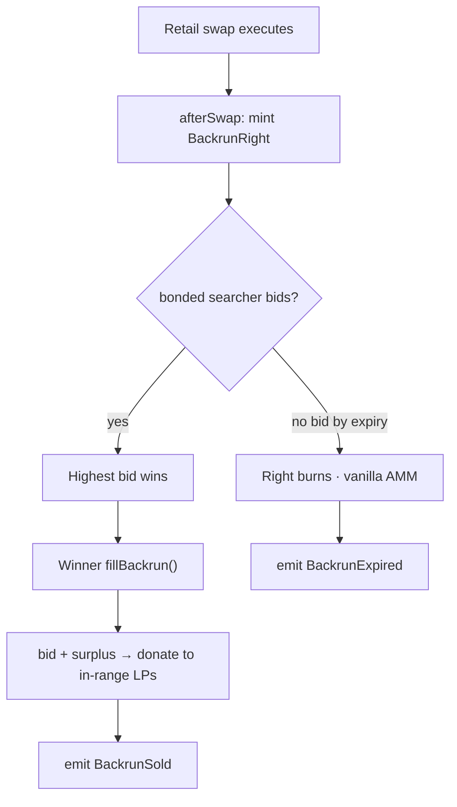
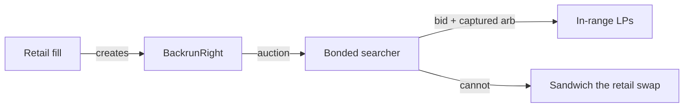
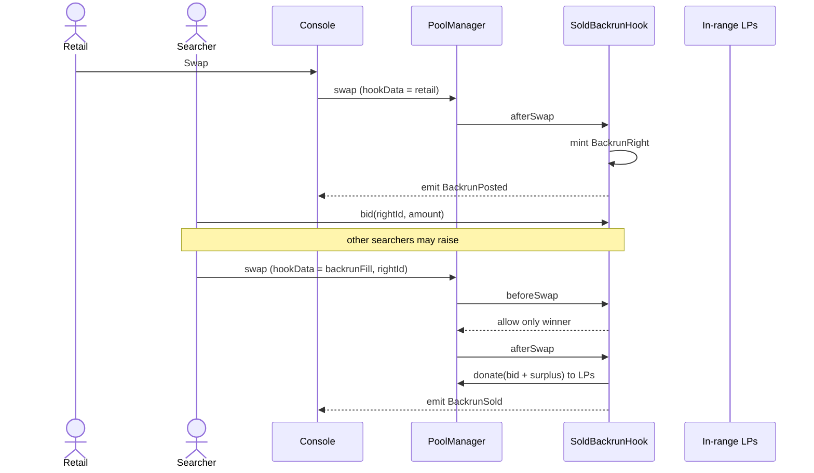
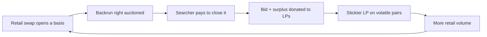

# Sold Backrun

[](./LICENSE)
[](https://docs.uniswap.org/contracts/v4/overview)

UHI10 — *Sustainable Liquidity & MEV Protection*

> **Every retail swap sells its own backrun. Sandwich dies because the leftover arb is already spoken for.**

---

## The idea

**Sold Backrun is a Uniswap v4 hook that turns the backrun of a swap into an on-pool product whose buyer is a searcher and whose seller is the LP.**

Today, a retail swap moves the pool. A searcher backruns it for free (or sandwiches it). The profit leaves the pool. LPs on volatile pairs eat LVR; the searcher keeps the arb.

Sold Backrun inverts that:

1. `afterSwap` **mints a backrun right** for this pool, this tick, this size.
2. Bonded searchers **bid** for that right in the same unlock or the next flashblock.
3. The winner's **bid plus captured arb** settle to the hook and are **`donate`d to in-range LPs**.
4. A sandwich is unprofitable because the leftover arb is **already sold**.

This is **not** a first-in-block LVR auction (53 prior UHI submissions). Those sell *who swaps first*. This sells *who is allowed to trade after this retail swap*.

It is Atrium's own UHI10 one-liner, productized: capture arb around the swap, route it back to LPs in `afterSwap`.

## The problem it solves

- **Sandwiches** need a backrun leg. If that leg is an exclusive, paid right, the sandwich bundle has nothing left to take.
- **LVR** is the CEX-DEX basis closed by the first searcher after a block. Selling that close to a bonded searcher **internalizes** the basis instead of leaking it.
- **Delay hooks** (AsyncSwapHook and ~18 cousins) hide the swap in time. They do not pay LPs. Sold Backrun lets the swap execute **now** and sells the consequence.
- **Fair Path** (sibling repo) *prices* toxic flow. Sold Backrun *markets* the residual arb. They compose; they are not the same hook.

## How it works

The hook never NoOps the retail swap. Retail always fills against the AMM. The hook's job is the **option that retail just created**.

1. **`beforeSwap`** — optional: tag the swap as `retail` vs `backrunFill` via `hookData`. Backrun fills are only valid if they hold the current right.
2. **`afterSwap` (retail)** — compute a backrun spec (pool, tick after swap, notional, expiry = this unlock or next flashblock). Open an auction.
3. **Searcher `bid(rightId, amount)`** — bonded searchers raise. Highest bid at expiry wins.
4. **Winner `fillBackrun(rightId, params)`** — a second swap (or a same-unlock swap) that is allowed to move the pool back toward fair value. The hook takes the bid and any surplus vs the spec, then `donate`s to LPs.
5. **Expiry with no bid** — right burns. Pool is no worse than a vanilla AMM.





## Auction model

Keep v1 **simple enough to demo in five minutes**. Not an EigenLayer AVS. Not a 53rd LVR TOB auction.

| Field | v1 choice | Why |
|---|---|---|
| Auction type | First-price, same-unlock / next-flashblock | Demoable; Flashblocks make "next slot" real on Unichain |
| Eligibility | `bonds[searcher] >= MIN_BOND` | Same bond primitive as Fair Path corridor 3; copy the ledger, do not import the fee engine |
| Reserve | `0` in demo; optional `minBid` later | Empty auctions must not brick retail |
| Settlement | Bid in token1 (or pool native) | One asset on the tape |
| Surplus | `max(0, arbProfit - bid)` also donated | LPs get bid **and** leftover |
| Failure | Right expires; retail already filled | Retail is never held hostage |

```solidity
struct BackrunRight {
    PoolId poolId;
    int24 tickAfter;
    uint256 notional;
    uint256 expiry;       // block or flashblock index
    address winner;
    uint256 bid;
    bool filled;
}
```

## Complete user flow



## Hook functions implemented

| Function | Permission | What it does |
|---|---|---|
| `getHookPermissions` | — | `afterInitialize`, `beforeSwap`, `afterSwap`, `afterSwapReturnDelta`. |
| `_afterInitialize` | `afterInitialize` | Dynamic-fee flag if a small backrun fee override is used; otherwise still records pool identity. |
| `_beforeSwap` | `beforeSwap` | If `hookData` is a backrun fill, require `msg` path holds the live right; else tag retail. |
| `_afterSwap` | `afterSwap` + return delta | Retail: mint right. Backrun fill: take bid + surplus, `donate`, close right. |
| `bid` | — | Bonded searcher raises on `rightId`. |
| `bond` / `unbond` | — | Eligibility capital. |

**On-chain parameters & state**

| Name | Meaning |
|---|---|
| `MIN_BOND` | Capital to bid |
| `AUCTION_WINDOW` | Blocks or flashblock slots until expiry |
| `totalBackrunPaid[poolId]` | Cumulative bid + surplus donated |
| `rights[rightId]` | Live / filled / expired spec |
| `BackrunPosted` / `BackrunBid` / `BackrunSold` / `BackrunExpired` | Tape for the console |

## Why this is not a sandwich

A sandwich is: front-run, victim, back-run. Sold Backrun **does not sell the front-run**. The retail swap is already in the pool when the right is minted (`afterSwap`). The only remaining extractable trade is the **close of the basis the retail swap just opened**. That close is sold. A searcher who also tries to front-run is a different product (Fair Path taxes and bonds that). This hook's claim is narrower and therefore judge-proof: **we sell the backrun, not "all MEV".**

## Integrations

| Layer | Integration | Used for |
|---|---|---|
| **Uniswap v4 core** | `PoolManager`, `donate`, `CurrencySettler` | Exclusive fill + LP payout |
| **OpenZeppelin** | `uniswap-hooks` `BaseHook` | Hook base |
| **Unichain** | Flashblocks (optional) | "Next slot" expiry that is faster than a full block |
| **Frontend / SDK** | `viem`, React, `@uniswap/v4-sdk` | Retail swap, live auction card, searcher bid, LP pot |

**Partner integrations (hookathon README requirement)**

- Unichain Flashblocks — optional expiry clock (`IFlashblockOracle`). Demo uses block-based expiry so the bench runs on Anvil.
- No Flashbots Protect integration is claimed here (that is Surplus Sink). No CoW Protocol. No Fhenix. No EigenLayer AVS.

## Why it's profitable — as an idea and a business



**For LPs.** They are paid for the arb their inventory created, every time, without running a searcher.

**For retail.** Execution is immediate. They are not delayed, encrypted, or sent to a dark pool. The sandwich's backrun leg is missing, so the attack shrinks.

**For searchers.** A clean, exclusive, bonded product: buy the right, fill, keep any edge above the bid if we later add a searcher remainder. v1 can donate 100% of surplus to LPs and still be a better deal than racing in the clear (they get exclusivity).

**For the protocol.** Auction flow is a MEV-native revenue line. v1: 100% LPs. Later: protocol split on the *bid*, never on the retail fee.

**Why it fits UHI10.** Defense (sandwich missing a leg) + recapture (donate) in one hook. Distinct from the 53 LVR auctions because the sold object is **the backrun of this swap**, not top-of-block.

## What this is not

- Not Fair Path (no attestation fee schedule in this repo).
- Not Surplus Sink (no Protect refunds).
- Not a CoW matcher.
- Not "we detect all sandwiches." We make the backrun a scarce right.

## The console (to be built)

Judge path — three clicks:

1. **Retail swap** — pool moves; `BackrunPosted` appears on the tape.
2. **Searcher bid** — auction card; bond if needed; bid lands.
3. **Fill** — LP pot ticks up by bid + surplus. Optional fourth click: attempt a sandwich; it cannot take the sold right.

Pages: Overview, Retail Swap, Auction, Searcher Bond, Analytics.

## Testing (to be built)

- **Unit** — mint on retail `afterSwap`; reject backrun fill from non-winner; expire with no bid; donate = bid + surplus; retail never reverts because the auction is empty.
- **Integration** — two searchers raise; winner fills; loser cannot fill.
- **Fuzz** — surplus donated is never negative; `totalBackrunPaid` equals sum of closed rights.
- **Adversarial** — same-unlock sandwich from a third address; right still exclusive to winner.

## Repository layout (target)

```
src/
  SoldBackrunHook.sol
  BackrunAuction.sol
  SearcherBond.sol
  interfaces/IBackrunAuction.sol
test/
  SoldBackrunHook.t.sol
  BackrunAuction.t.sol
frontend/
  src/pages/{Overview,Swap,Auction,Bond,Analytics}*
```

## Hookathon gates

- Public repo (this repository)
- Valid Uniswap v4 hook
- Functioning frontend that calls the hook
- README partner integrations: Unichain Flashblocks (optional seam + Anvil expiry). No theoretical partners.
- Video: retail swap → bid → fill → LP pot, then a failed sandwich, no AI voice
- Original work for UHI10; not a resubmission of Fair Flow
