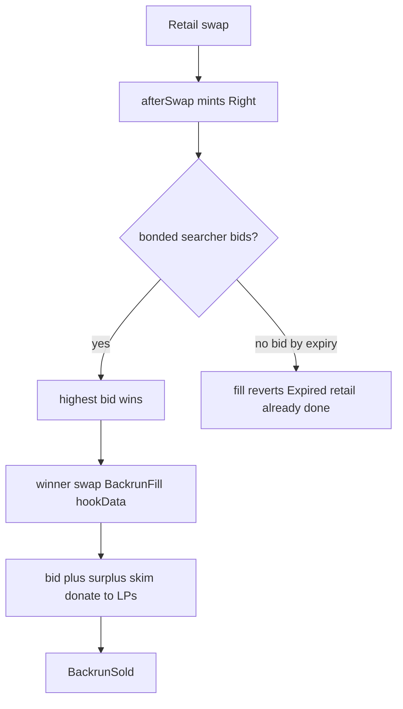
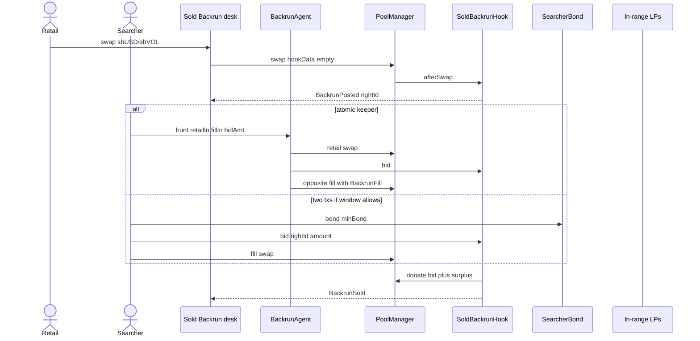
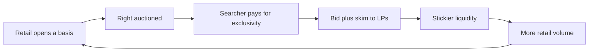

# Sold Backrun

[](./LICENSE)
[](https://docs.uniswap.org/contracts/v4/overview)
[](https://sepolia.uniscan.xyz)

**Live desk:** [uhi10-sold-backrun.vercel.app](https://uhi10-sold-backrun.vercel.app) · **Agent:** [/agent](https://uhi10-sold-backrun.vercel.app/agent) · **Pool:** sbUSD / sbVOL · **Hook:** [`0x2F5EC31089512943E9cf06a7F949E445d8E9D0C4`](https://sepolia.uniscan.xyz/address/0x2F5EC31089512943E9cf06a7F949E445d8E9D0C4)

> Every retail swap sells its own backrun. The sandwich dies because the leftover arb is already spoken for.

---

## The idea

Sold Backrun is a **Uniswap v4 hook that turns the backrun of a retail swap into an on-pool product**. The seller is the LP book. The buyer is a bonded searcher.

Today a retail trade moves the pool; a searcher backruns (or sandwiches) for free; profit leaves the venue. This hook inverts that:

1. Retail always fills immediately against the AMM (no delay, no dark pool).
2. `afterSwap` **mints an exclusive backrun right** for that pool, with a **2-block** auction window.
3. Bonded searchers **first-price bid** in the bond asset (`sbUSD`). Previous high bidder is refunded.
4. The winner **fills** with 96-byte `hookData` (`Kind.BackrunFill`, `rightId`, searcher). Bid + a **0.50% surplus skim** are `donate`d to in-range LPs.

This is **not** a top-of-block LVR auction (those sell *who swaps first*). This sells *who may trade after this retail swap*.

On Unichain Sepolia the window is too tight for a second mempool hop. **`BackrunAgent.hunt()`** posts retail, bids, and fills **in one transaction**.

---

## The problem it solves

- **Sandwiches need a backrun leg.** If that leg is an exclusive paid right, the sandwich bundle has nothing left to take.
- **LVR** is the CEX–DEX basis closed by the first searcher after the trade. Selling that close **internalizes** the basis instead of leaking it.
- **Delay hooks** hide the swap in time. They do not pay LPs. Sold Backrun lets the swap execute **now** and sells the consequence.
- Sibling **Fair Path** *prices* toxic flow. Sold Backrun *markets* residual arb. Different hooks, same theme.

---

## How it works

Empty `hookData` = retail (`RETAIL_FEE` 0.05%). Fill `hookData` must be **exactly 96 bytes**.

1. **`beforeSwap`** — retail: low fee. Fill: require live right, not expired, not filled, `winner == searcher`, matching `poolId`; fee `BACKRUN_FEE` 0.30%.
2. **`afterSwap` (retail)** — mint `Right { expiry = block.number + 2, winner: 0, bid: 0 }`, emit `BackrunPosted`.
3. **`bid(rightId, amount)`** — bonded searcher, `amount > current bid`, transfer `bidToken`, refund previous winner.
4. **`afterSwap` (fill)** — mark filled, skim `SURPLUS_BIPS` of the unspecified token, donate bid (if bid token is a pool currency) + surplus to LPs, emit `BackrunSold`.

If nobody bids, retail still filled. A late fill reverts `Expired`. There is **no** `fillBackrun()` helper; the fill *is* a swap.



---

## Complete user flow



---

## Hook functions implemented

| Surface | Permission | Behavior |
|---|---|---|
| `getHookPermissions` | — | `afterInitialize`, `beforeSwap`, `afterSwap`, `afterSwapReturnDelta` |
| `_afterInitialize` | `afterInitialize` | require dynamic-fee pool |
| `_beforeSwap` | `beforeSwap` | retail vs fill checks; override fee |
| `_afterSwap` | `afterSwap` + return delta | mint right or settle bid + surplus |
| `bid` | — | first-price auction in `bidToken` |
| `BackrunAgent.arm` / `hunt` / `huntMany` | agent | bond, retail, bid, fill atomically |
| `SearcherBond.bond` / unbond / slash | eligibility | slash reserved for a hook if wired |

Constants: `RETAIL_FEE = 500`, `BACKRUN_FEE = 3000`, `AUCTION_WINDOW = 2`, `SURPLUS_BIPS = 50`.

---

## Deployments — Unichain Sepolia (chainId 1301)

| Contract | Address |
|---|---|
| **SoldBackrunHook** | [`0x2F5EC31089512943E9cf06a7F949E445d8E9D0C4`](https://sepolia.uniscan.xyz/address/0x2F5EC31089512943E9cf06a7F949E445d8E9D0C4) |
| **SearcherBond** | [`0xAaa33009F9E128f00C68A26c64184C8734F533bF`](https://sepolia.uniscan.xyz/address/0xAaa33009F9E128f00C68A26c64184C8734F533bF) |
| **BackrunAgent** | [`0x36a743e4Bf92E279CE5CA36aD0e61eD3A9c480cc`](https://sepolia.uniscan.xyz/address/0x36a743e4Bf92E279CE5CA36aD0e61eD3A9c480cc) |
| sbUSD (token0, bid / bond asset) | [`0x6DA5F7DeD53AaAa1BA851cd90D0F46A760810e3f`](https://sepolia.uniscan.xyz/address/0x6DA5F7DeD53AaAa1BA851cd90D0F46A760810e3f) |
| sbVOL (token1) | [`0xDd41eC4AFd854d79E0eD6055d873476Ca390c147`](https://sepolia.uniscan.xyz/address/0xDd41eC4AFd854d79E0eD6055d873476Ca390c147) |
| PoolManager | [`0x00B036B58a818B1BC34d502D3fE730Db729e62AC`](https://sepolia.uniscan.xyz/address/0x00B036B58a818B1BC34d502D3fE730Db729e62AC) |
| SwapRouter | [`0x9cD2b0a732dd5e023a5539921e0FD1c30E198Dba`](https://sepolia.uniscan.xyz/address/0x9cD2b0a732dd5e023a5539921e0FD1c30E198Dba) |
| PositionManager | [`0xf969Aee60879C54bAAed9F3eD26147Db216Fd664`](https://sepolia.uniscan.xyz/address/0xf969Aee60879C54bAAed9F3eD26147Db216Fd664) |
| Permit2 | [`0x000000000022D473030F116dDEE9F6B43aC78BA3`](https://sepolia.uniscan.xyz/address/0x000000000022D473030F116dDEE9F6B43aC78BA3) |
| StateView | [`0x08a96ca60f3bF04A5F1eC4DaEE0572C5676CBe8E`](https://sepolia.uniscan.xyz/address/0x08a96ca60f3bF04A5F1eC4DaEE0572C5676CBe8E) |

Pool fee flag: `8388608` (dynamic). Tick spacing: `60`. Deploy block: `61520777`. See `frontend/src/deployed.json`.

---

## Integrations

| Partner / layer | How Sold Backrun uses it |
|---|---|
| **Uniswap v4** | PoolManager swaps, donate, settler |
| **OpenZeppelin uniswap-hooks** | `BaseHook` |
| **Unichain Sepolia v4 periphery** | shared PM / router / POSM |
| **Permit2 + POSM** | LP from the desk |
| **viem + v4 SDK** | retail swap, tape, hunt |

Expiry is `block.number + AUCTION_WINDOW`. This hook has **no** flashblock oracle.

---

## Why this is a business

You are selling **exclusive rights to close the basis a retail trade just opened**. Searchers already pay for that in latency and revert risk. Here they pay LPs, on-chain, with a receipt.



**Unit economics (v1)**

- **LP take:** 100% of winning bid (when the bid token is in-pool) + surplus skim. That is LVR internalized per swap, not “maybe MEV later.”
- **Searcher take:** exclusivity. They skip the gas war; they fill the only legal backrun. v1 can donate all surplus and still beat racing in the clear.
- **Retail take:** immediate execution; sandwich’s backrun leg is missing, so the attack shrinks without encrypting the trade.
- **Protocol take (later):** a cut of the **bid**, never of the retail 0.05% fee. Auction flow is a MEV-native revenue line (like a small orderflow auction, scoped to *this* pool’s leftover).

**Go-to-market:** volatile pairs, solver networks that already run backrunners, then wallets that want “no sandwich” without Protect UX. `hunt()` is the keeper SKU.

**UHI10 fit:** defense (sandwich missing a leg) + recapture (`donate`) in one hook. Distinct from 53 TOB auctions because the sold object is **the backrun of this swap**.

---

## What this is not

Not Fair Path (no attestation schedule). Not Surplus Sink (no Protect receipts). Not “we detect all sandwiches.” We make the backrun a scarce right.

## Tests and layout

`forge test` — retail post, bid/refund, fill, expiry, agent hunt, invariants, fork.

```
src/SoldBackrunHook.sol  src/SearcherBond.sol  src/BackrunAgent.sol
test/  script/  frontend/
```

## Hookathon gates

Public repo · valid v4 hook · live UI · Unichain v4 periphery · original UHI10 work.
